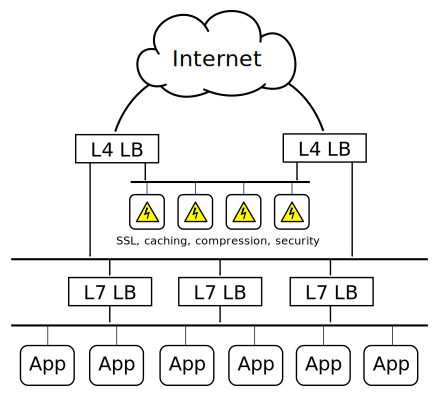

Double-layer Load Balancing Scheme with SSL Temination and Caching 
==================================================================

Hardware vs. Software
---------------------

Hardware load balancers most suited for *L4* packet routing as they can operate on network speeds. For *L7* load balancing sowtware solutions are the most effective since *L7* routing requires a lot of buffering and custom logic.

SSL
---
With SSL the load balancer will not be able to access HTTP contents for making routing decisions.  With built-in SSL support however, the load balancer quickly becomes the bottleneck. Load balancer will saturate much earlier than the application servers. The right solution is to have a dedicated SSL termination server pool.

Caching
-------
Most e-business applications present a cacheability rate between 80 and 90%, which means that these reverse proxy caches will offload the servers by at least 80% of the requests. Adding this to the fact that SSL proxies can be shared between multiple applications, the overall gain reduces the need for big and numerous application servers, which impacts maintenance and licencing costs too.

Solution
--------
The solution is to use a first level of network-based load balancers (possibly hardware-accelerated) to perform layer-4 balancing between both SSL reverse proxies and a second level of proxy-based layer-7 load balancers. 

First, the checks performed by the layer-4 load balancer on the layer-7 load balancers will always be more reliable than the self-analysis performed by proxies. Second, this provides the best overall scalability because when the proxies will saturate, it will always be possible to add more, till the layer-4 load balancer saturates in turn. At this stage, we are talking about filling multi-gigabit pipes. It will then be time to use DNS round robin techniques to present multiple layer-4 load balancers, preferably spread over multiple sites.

References:
-----------
* [Making applications scalable with Load Balancing](http://1wt.eu/articles/2006_lb/) by Willy Tarreau